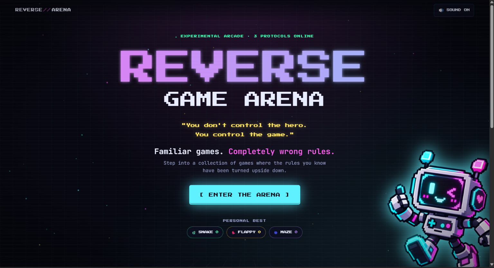
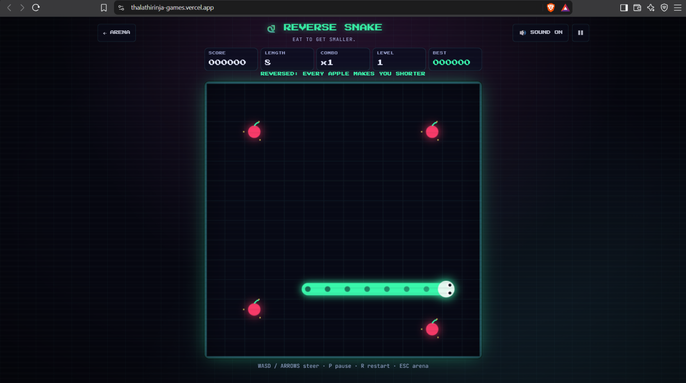
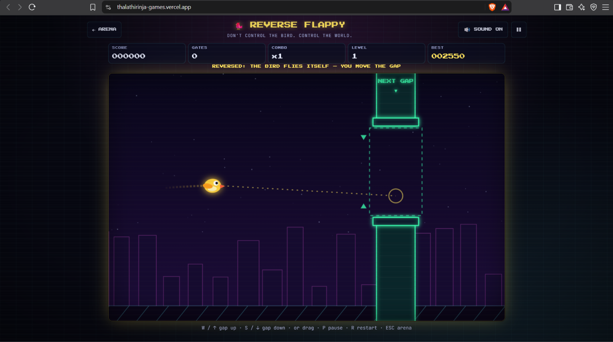
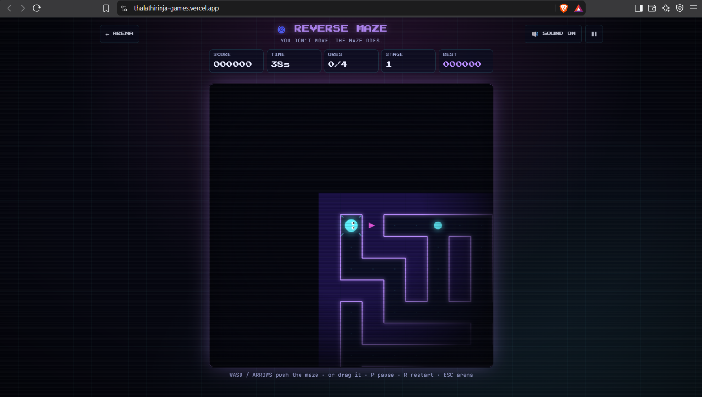

# Reverse Game Arena 🎯

## Basic Details
### Team Name: LUNA

### Team Members
- Team Lead: Karthik C K - COCHIN UNIVERSITY OF SCIENCE AND TECHNOLOGY
- Member 2: Megha Suresh - COCHIN UNIVERSITY OF SCIENCE AND TECHNOLOGY

### Project Description
A browser arcade of familiar games with their core rule flipped. Built with React, TypeScript, Vite and HTML5 Canvas. There are no game engines, no audio files and no runtime dependencies besides React.

### The Problem (that doesn't exist)
Gaming has become too easy and predictable. We always control the hero, and the world just sits there waiting to be beaten. It's time to turn the tables!

### The Solution (that nobody asked for)
You don't control the hero. You control the game!
- Reverse Snake: Eat apples and shrink!
- Reverse Flappy: The bird flies itself, you move the pipe gap!
- Reverse Maze: You're locked in place, you move the maze!

## Technical Details
### Technologies/Components Used
For Software:
- TypeScript, HTML5 Canvas
- React
- Vite
- WebAudio API

For Hardware:
- None

### Implementation
For Software:
# Installation
```bash
npm install
```

# Run
```bash
npm run dev
```

### Project Documentation
For Software:

# Screenshots

*Reverse Game Arena - Choose your game*


*Reverse Snake - Eat apples and shrink*


*Reverse Flappy - You move the pipe gap*


*Reverse Maze - You move the maze*

# Diagrams
```text
                  ┌──────────────────────┐
                  │       PLAYER         │
                  │  Mobile / Desktop    │
                  └──────────┬───────────┘
                             │
                     User Interaction
                             │
                             ▼
              ┌────────────────────────────┐
              │      GAME INTERFACE        │
              │                            │
              │  Lobby • HUD • Controls    │
              └────────────┬───────────────┘
                           │
                           ▼
              ┌────────────────────────────┐
              │      REVERSE ENGINE        │
              │                            │
              │  Input → Game Logic        │
              │        ↓                   │
              │  Reverse Mechanics         │
              │        ↓                   │
              │  Collision / Physics       │
              └────────────┬───────────────┘
                           │
             ┌─────────────┼─────────────┐
             ▼             ▼             ▼
        ┌─────────┐   ┌─────────┐   ┌─────────┐
        │ Reverse │   │ Reverse │   │ Reverse │
        │  Snake  │   │  Flappy │   │  Game N │
        └────┬────┘   └────┬────┘   └────┬────┘
             │             │             │
             └─────────────┼─────────────┘
                           ▼
                 ┌───────────────────┐
                 │   GAME STATE      │
                 │ Score • Level     │
                 │ Lives • Progress  │
                 └─────────┬─────────┘
                           │
                           ▼
                 ┌───────────────────┐
                 │    LOCAL DATA     │
                 │  High Scores etc. │
                 └───────────────────┘

                           ▲
                           │
                 ┌─────────┴─────────┐
                 │      VERCEL       │
                 │   Web Deployment  │
                 └───────────────────┘
```
*GameShell manages the arena cards, loading transition, HUD, pause and game-over screens, high scores and input handling. Per-frame game state lives inside the engines, not in React.*

For Hardware:
None

# Schematic & Circuit
None

# Build Photos
None

### Project Demo
# Video
https://www.youtube.com/watch?v=mnBU_yAJPBw
*A walkthrough of the reversed games*

# Additional Demos
None

## Team Contributions
- Karthik C K: ui/ux and implementation
- Megha Suresh: Planning and logic

---
Made with ❤️ at TinkerHub Useless Projects 


